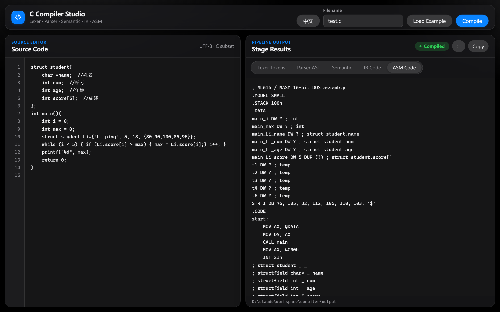

# Compiler

> A compiler for C-subset language implemented in Python

<a href="./README.md">English</a> | <a href="./README.zh-CN.md">中文</a>

[](https://python.org)
[](LICENSE)



## Pipeline

```
Source Code → Lexer → Parser → Semantic → IR → ASM
```

Features:
- Lexer (Tokenization)
- Recursive Descent Parser + AST
- Semantic Analysis + Symbol Table
- Quadruple IR Generation
- 16-bit x86 ASM CodeGen
- CLI + GUI + Web Interface
- Web UI with adaptive light/dark theme and Chinese / English switcher

## Quick Start

```bash
python src/main.py examples/test.c
```

Output files:
- `output/test.tokens.txt` — Tokens
- `output/test.ast.txt` — AST
- `output/test.ir.txt` — IR (Quadruples)
- `output/test.asm` — ASM (x86)

## Visual Interface

```bash
# GUI
python src/gui.py

# Web (visit http://127.0.0.1:8000)
python -B src/webapp.py
```

## Project Structure

```
compiler/
├── examples/
│   └── test.c              # Test source
├── src/
│   ├── lexer/              # Lexer
│   ├── parser/            # Parser + AST
│   ├── semantic/          # Semantic Analysis
│   ├── ir/                # IR Generation
│   ├── codegen/           # Code Generation
│   ├── main.py            # CLI entry
│   ├── gui.py             # GUI entry
│   └── webapp.py          # Web entry
└── output/                # Generated files
```

## Supported Features

| Feature | Description |
|---------|-------------|
| Types | `int`, `char`, `float`, `void` |
| Struct, Pointer | User-defined types |
| Functions | Definition, parameters, calls |
| Arrays, Struct Variables | Complex data types |
| Expressions | Arithmetic, relational, logical |
| Control Flow | `if/else`, `while`, `for`, `do while` |
| I/O | `printf`, `scanf` |
| Type Checking | Scope, symbol table, type checking |

## ASM Verification

Requires DOSBox for 16-bit execution:

```bat
mount c D:\compiler\output
c:
masm test.asm;
link test.obj;
test
```

## License

MIT License — see [LICENSE](LICENSE)
